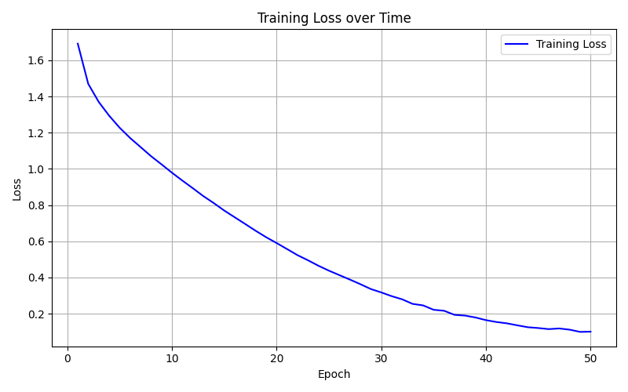
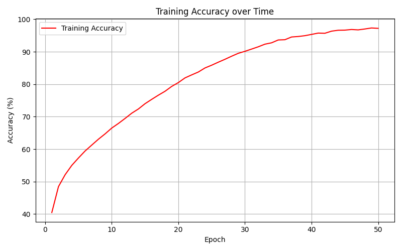

# CIFAR10 Simple ANN Classifier
A 3-layer feedforward neural network for classifying CIFAR10 images into 10 categories.

## Dataset
**CIFAR10** contains 60,000 32×32 color images across 10 classes:
- Airplane
- Automobile
- Bird
- Cat
- Deer
- Dog
- Frog
- Horse
- Ship
- Truck
The dataset is split into 50,000 training images and 10,000 test images.

## Architecture
```
Input (3×32×32 RGB) 
    ↓
Flatten to 3,072 features
    ↓
Fully Connected Layer (3,072 → 512) + ReLU
    ↓
Fully Connected Layer (512 → 256) + ReLU
    ↓
Fully Connected Layer (256 → 10)
    ↓
Output (10 class logits)
```

**Model Specifications:**
- **Layers:** 3 fully connected layers
- **Hidden units:** 512 → 256
- **Activation:** ReLU
- **Loss function:** Cross-Entropy Loss
- **Optimizer:** Adam (learning rate = 0.001)
- **Batch size:** 64
- **Epochs:** 20

## Usage
```bash
python classifier.py
```

The script will:
1. Download CIFAR10 dataset automatically (first run only)
2. Train the model for 20 epochs
3. Display progress every 100 mini-batches
4. Generate two plots: `training_loss.png` and `training_accuracy.png`
5. Evaluate on the test set

## Results

**Performance:**
- Final Training Accuracy: **86.41%**
- **Test Accuracy: 52.14%**
- Training time: ~3 minutes on CPU (20 epochs)

### Training Progress


### Training Plots

**Loss over time:**



**Accuracy over time:**



### Analysis

The gap between training accuracy (86.41%) and test accuracy (52.14%) indicates overfitting. Fully-connected networks have fundamental limitations on image data:

1. **No spatial awareness** - Treats each pixel independently, ignoring 2D structure
2. **High parameter count** - 1.6M+ parameters enable memorization of training data
3. **Lack of translation invariance** - Cannot recognize shifted or transformed objects
4. **No hierarchical features** - Doesn't build representations from edges → textures → shapes

These results demonstrate why CNNs achieve better generalization on vision tasks through spatial inductive biases.

## Requirements
```
torch
torchvision
matplotlib
```

Install with:
```bash
pip install torch torchvision matplotlib
```

## Next Steps

- [ ] Implement CNN architecture for comparison
- [ ] Add dropout for regularization
- [ ] Implement data augmentation
- [ ] Learning rate scheduling
- [ ] Per-class accuracy analysis
- [ ] Visualize learned features
